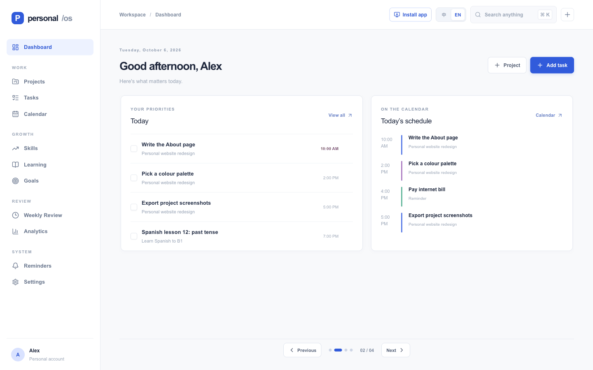
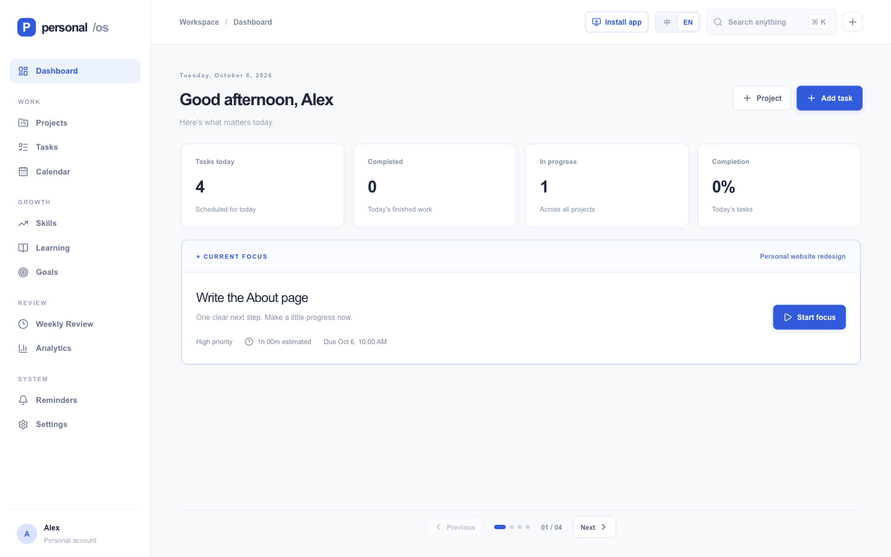
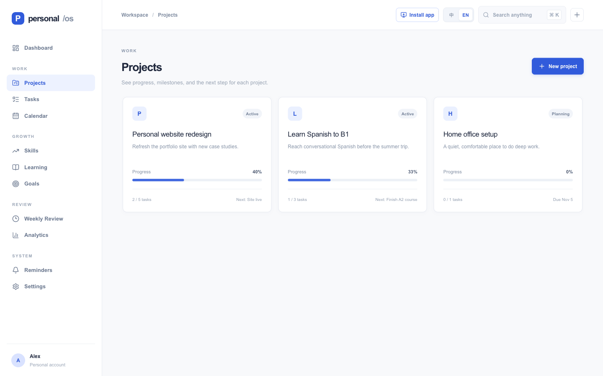
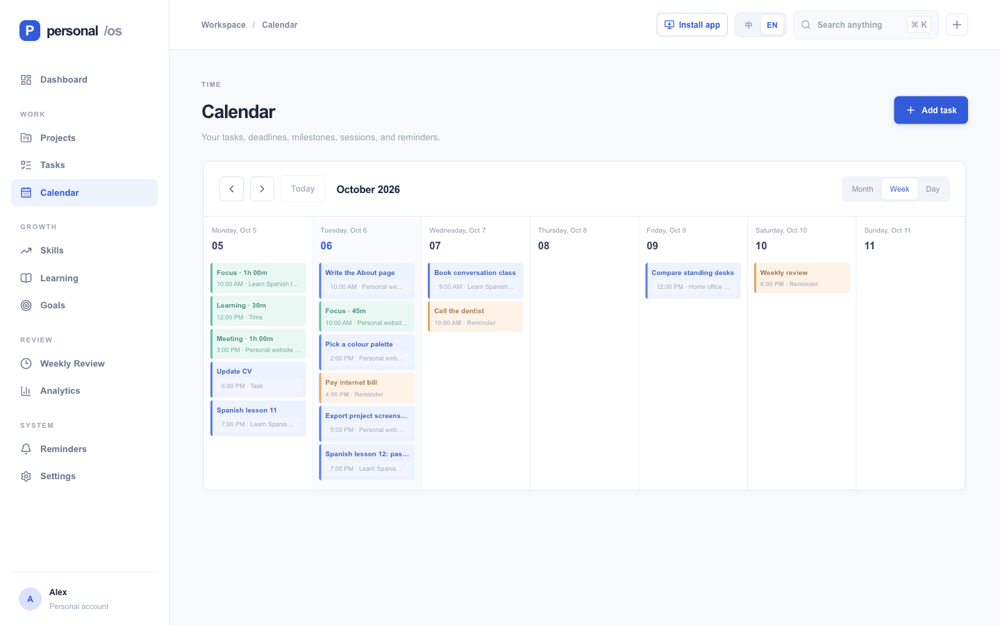
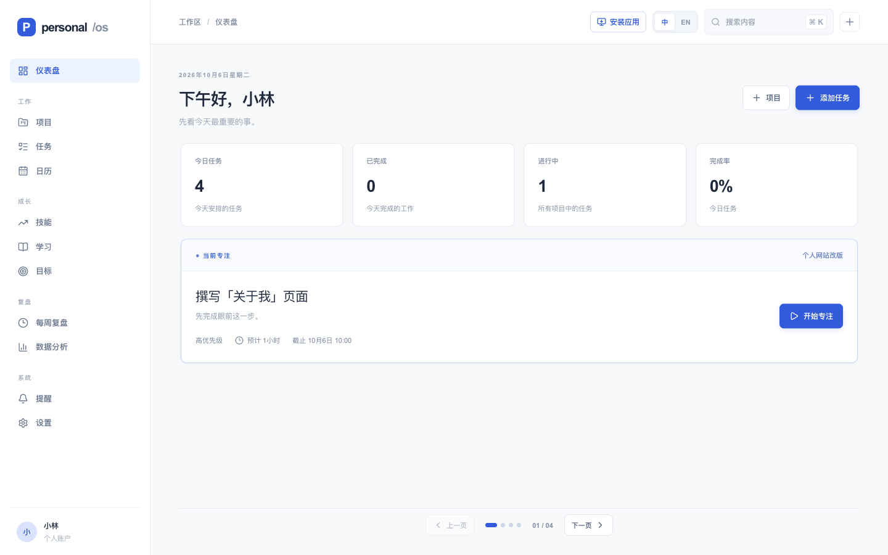
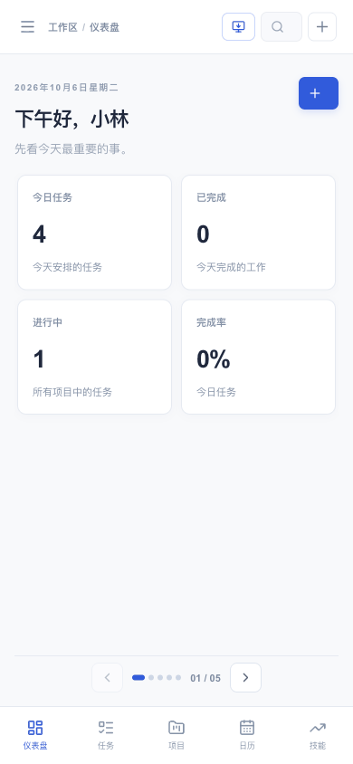
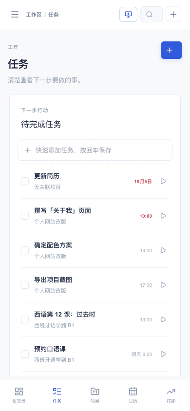

<div align="center">


# Personal OS

**A calm, bilingual command center for your tasks, projects, focus time and personal growth.**

All your data stays on your own device. No account, no server, no tracking.

[中文说明](README.zh-CN.md) · [User guide](docs/user-guide.md) · [Deployment](docs/deployment.md) · [Changelog](CHANGELOG.md)

[](https://vercel.com/new/clone?repository-url=https://github.com/supermemeseveryday-star/personal-os)
[](https://github.com/supermemeseveryday-star/personal-os/actions/workflows/ci.yml)




</div>

## What is it?

Personal OS is a web app that works like a native app. It brings together the things you usually keep in five different tools: a to-do list, a project board, a calendar, a focus timer and a learning journal, and connects them so your daily work rolls up into the goals you care about.

It is designed for one person. Everyone who opens the site gets their **own private, empty workspace** stored in their browser, so you can publish it once and share the link with anyone.

## Features

| | |
|---|---|
| **Dashboard** | Today's tasks, what to focus on next, today's schedule, active projects, reminders and time invested this week. |
| **Tasks** | Quick add (type and press Enter), priorities, due dates, tags, estimates. Overdue items turn red. |
| **Projects** | Progress bars, milestones, notes and linked skills. Archive and restore. |
| **Focus timer** | Start focus on any task. The timer keeps running in the header while you work elsewhere, and each session is logged. |
| **Calendar** | Month, week and day views of tasks, reminders, milestones and sessions. Add a task to any day with one click. |
| **Growth** | Track skills (0–100), log learning sessions and set long-term goals linked to projects and skills. |
| **Review** | A weekly review page and 7-day analytics for completed tasks and focus time. |
| **Bilingual** | Full Chinese and English interface. Switch any time. |
| **Installable app** | Add it to your desktop or home screen. Opens in its own window, works offline, and offers shortcuts (New task, Calendar, Log learning) from the app icon. |
| **Keyboard first** | `⌘K` command palette, `N` new task, `⌘Enter` save, `←` `→` switch pages. |
| **Safe by default** | Every delete can be undone. Export and import JSON backups at any time. |

## Screenshots

The app starts empty. These screenshots show it after someone has added their own tasks and projects.

| Dashboard | Projects |
|---|---|
|  |  |
| **Calendar** | **Chinese interface** |
|  |  |

<p align="center">
  
  &nbsp;&nbsp;
  
</p>

## Quick start

**Use it online:** deploy your own copy with the **Deploy with Vercel** button above (free, about one minute), then open the link.

**Run it on your computer** (requires [Node.js](https://nodejs.org) 22 or newer):

```bash
git clone https://github.com/supermemeseveryday-star/personal-os.git
cd personal-os
npm install
npm run dev
```

Open http://localhost:3000. The workspace starts empty, and a short guide on the dashboard walks you through your first project and task.

## Install as an app

| Device | How |
|---|---|
| Chrome / Edge (Windows, macOS, Android) | Click **Install app** in the header, or the install icon in the address bar |
| iPhone / iPad | Open in Safari → Share → **Add to Home Screen** |
| Safari on macOS | File → **Add to Dock** |

On iPhone, install it before you start adding records: Safari and the home-screen app keep separate storage.

## Where is my data?

- Everything is saved in your browser's `localStorage` on **this device only**. Nothing is sent to a server, and the site owner cannot see it.
- Each browser and device has its own workspace. To move data, use **Settings → Export data** on the old device and **Import data** on the new one.
- Clearing site data or uninstalling the app deletes your records, so export a backup now and then.

## Documentation

- [User guide](docs/user-guide.md): every page and feature explained
- [Deployment guide](docs/deployment.md): Vercel, other hosts, custom domains
- [Contributing](CONTRIBUTING.md): how to report bugs and propose changes

## Built with

[Next.js](https://nextjs.org) 16 · [React](https://react.dev) 19 · TypeScript · [Tailwind CSS](https://tailwindcss.com) 4 · [Radix UI](https://www.radix-ui.com) · [cmdk](https://cmdk.paco.me) · [Lucide](https://lucide.dev) icons

## Project structure

```
app/                      Next.js routes, global styles, web app manifest
components/
  personal-os.tsx         The application UI (pages, forms, focus timer, toasts)
  page-deck.tsx           Paged content area with keyboard and swipe navigation
  ui/                     shadcn/ui primitives: dialog, command palette, checkbox
lib/
  model.ts                Data types and date helpers (viewer's local time zone)
  storage.ts              Load and save to localStorage
  i18n.ts                 Chinese translations of interface text
public/                   App icons and the offline service worker (sw.js)
docs/                     User guide, deployment guide, screenshots
```

## Scripts

| Command | What it does |
|---|---|
| `npm run dev` | Start the development server |
| `npm run build` | Build for production |
| `npm start` | Run the production build |
| `npm run typecheck` | Check TypeScript types |

## License

[MIT](LICENSE). Free to use, modify and share. Please keep the copyright notice.
